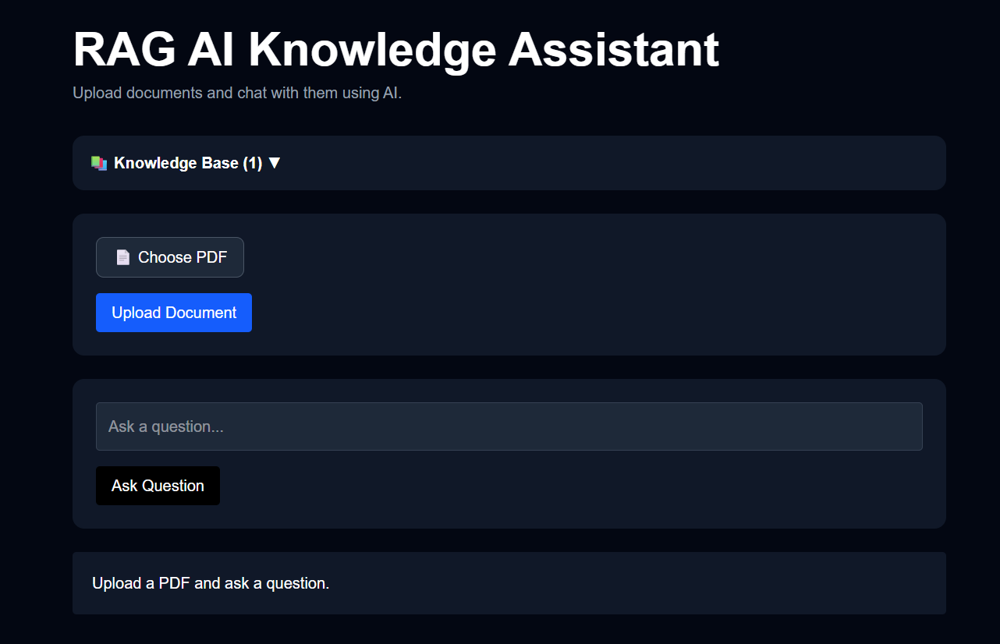
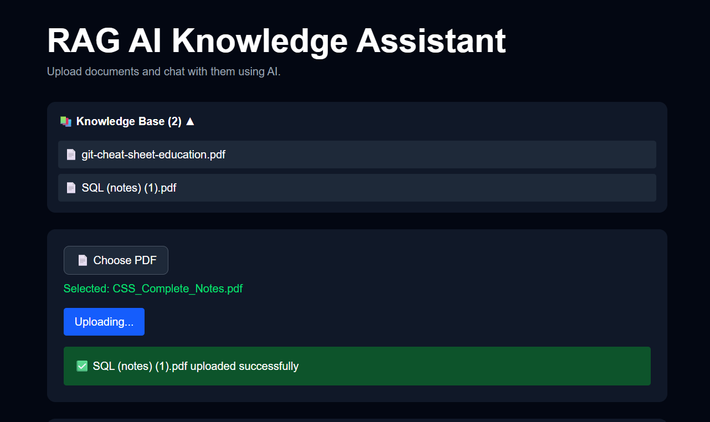
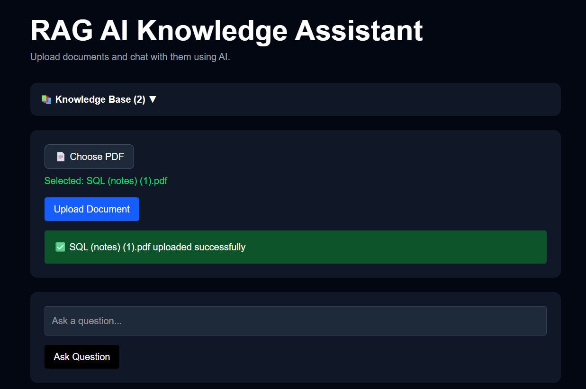
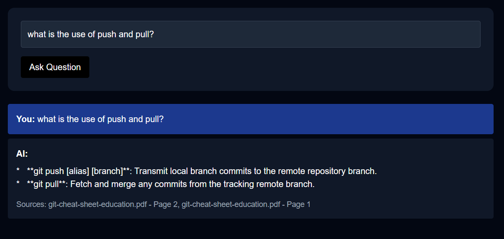

#  RAG AI Knowledge Assistant

🌐 **Live Demo:** https://rag-ai-knowledge-assistant.vercel.app/

🧠 An AI-powered Retrieval-Augmented Generation (RAG) application that enables users to upload PDF documents and interact with them using natural language. The system combines semantic retrieval, vector search, and Google's Gemini LLM to provide accurate answers with source citations and page references.

---

# 🌟 Features

### 📄 Multi-PDF Knowledge Base

* Upload one or multiple PDF documents
* Automatically builds a searchable knowledge base
* Stores and retrieves information from uploaded documents

### 🤖 AI-Powered Question Answering

* Ask questions in natural language
* Context-aware answers generated using Gemini 2.5 Flash
* Retrieval-Augmented Generation (RAG) architecture

### 🔍 Semantic Search

* Intelligent document chunking using LangChain
* Embeddings generated with Gemini Embeddings
* FAISS vector database for fast semantic retrieval

### 📚 Source Citations

* Displays source document names
* Includes page number references
* Improves transparency and trustworthiness of responses

### 🌐 Full-Stack Deployment

* Frontend deployed on Vercel
* Backend deployed on Render
* Publicly accessible AI application

---

# 🏗️ System Architecture

```text
User Uploads PDF
        │
        ▼
PDF Processing (PyPDF)
        │
        ▼
Text Chunking (LangChain)
        │
        ▼
Gemini Embeddings
        │
        ▼
FAISS Vector Database
        │
        ▼
Similarity Search
        │
        ▼
Gemini 2.5 Flash
        │
        ▼
Answer with Citations
```

---

# 🛠️ Tech Stack

## Frontend

* Next.js
* React
* TypeScript
* Tailwind CSS

## Backend

* FastAPI
* Python

## AI & RAG

* Google Gemini 2.5 Flash
* Gemini Embeddings
* LangChain
* FAISS Vector Database

## Document Processing

* PyPDF

## Deployment

* Vercel
* Render

## Version Control

* Git
* GitHub

---

# 📸 Screenshots

## Home Page



## Knowledge Base Panel



## PDF Upload



## Question Answering with Citations



---

# 🚀 Live Demo

### Frontend Application

https://rag-ai-knowledge-assistant.vercel.app/

### Backend API

https://rag-ai-knowledge-assistant-z73f.onrender.com/

---

# ⚙️ Installation

## Clone Repository

```bash
git clone https://github.com/imvivek14/RAG-AI-Knowledge-Assistant.git

cd RAG-AI-Knowledge-Assistant
```

---

## Backend Setup

```bash
cd backend

python -m venv venv

venv\Scripts\activate

pip install -r requirements.txt

uvicorn main:app --reload
```

---

## Frontend Setup

```bash
cd frontend

npm install

npm run dev
```

---

# 🔑 Environment Variables

Create a `.env` file inside the backend directory:

```env
GEMINI_API_KEY=YOUR_GEMINI_API_KEY
```

---

# 📂 Project Structure

```text
RAG-AI-Knowledge-Assistant
│
├── backend
│   ├── main.py
│   ├── requirements.txt
│   ├── uploads
│   └── vectorstore
│
├── frontend
│   ├── app
│   ├── public
│   ├── package.json
│   ├── next.config.ts
│   └── tsconfig.json
│
└── README.md
```

---

# 🎯 Key Learning Outcomes

* Retrieval-Augmented Generation (RAG)
* Semantic Search
* Vector Databases (FAISS)
* Embedding Models
* LLM Integration
* FastAPI Development
* Next.js Development
* Full-Stack AI Engineering
* Cloud Deployment
* Git & GitHub Workflows

---

# 🔮 Future Improvements

* User Authentication
* Drag-and-Drop PDF Upload
* Streaming AI Responses
* Citation Highlighting
* Persistent Cloud Vector Database
* Multi-User Support
* DOCX and TXT File Support
* Conversation Memory
* Advanced Analytics Dashboard

---

# 💡 Why This Project?

Traditional LLMs answer based on their training data. This project uses Retrieval-Augmented Generation (RAG) to retrieve relevant information from uploaded documents before generating answers. This makes responses more accurate, document-aware, and explainable through source citations.

---

# 👨‍💻 Author

**Vivek Surati**

Computer Science Engineer | AI Engineer Aspirant

GitHub: https://github.com/imvivek14

LinkedIn: https://www.linkedin.com/in/vivek-surati-752906347/

---

⭐ If you found this project interesting, consider giving it a star.
